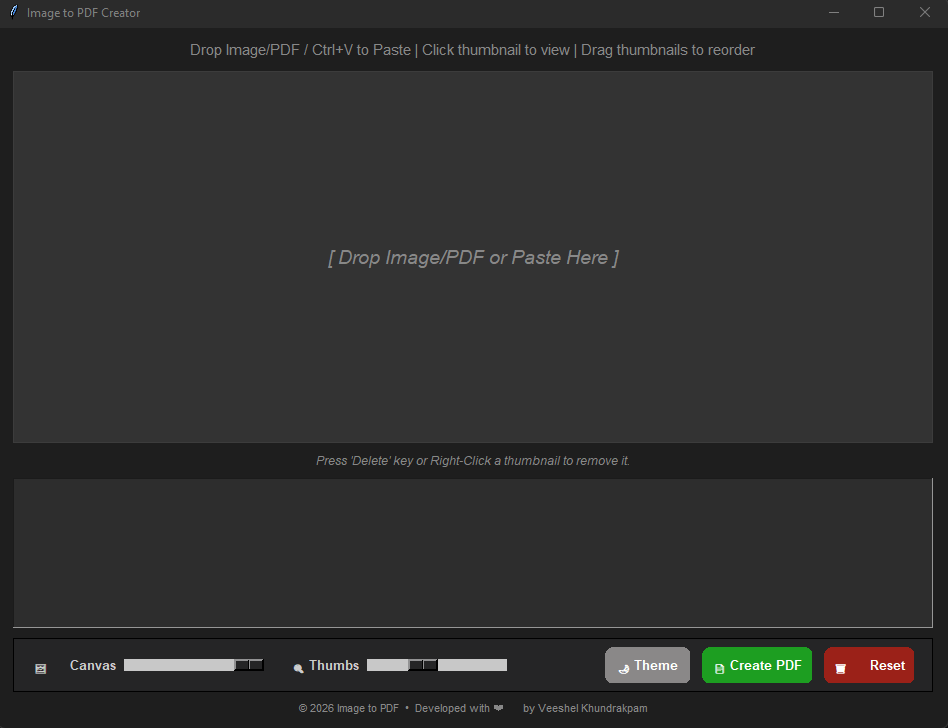
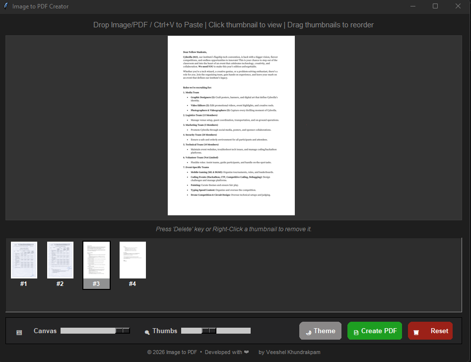

#  Image to PDF
# README

### Intro
Image to PDF is a lightweight, cross-platform desktop utility that converts dropped or pasted images and PDF pages into a single compiled PDF. It provides a visual preview, thumbnail ordering, and quick export so you can assemble multi-page PDFs from screenshots, photos, or document scans with ease.

### Features and how it works
- **Drag & Drop / Clipboard Support:** Drag image files or PDFs directly into the workspace, or paste images (`Ctrl+V` / `Cmd+V`) straight from your clipboard.
- **Smart Page Insertion:** New items automatically insert right after your currently selected thumbnail for fast organizing.
- **Thumbnail Tray & Auto-Scroll Reordering:** Click a thumbnail to view it on the main canvas. Drag thumbnails left or right to reorder pages—holding a dragged item near the tray edges automatically scrolls through long lists.
- **Multi-Level Undo (`Ctrl+Z` / `Cmd+Z`):** Easily revert additions, deletions, reset actions, or layout changes.
- **Interactive Canvas Controls:** 
  - Independent **Fit-to-Screen Slider** ($10\%$ to $100\%$ viewport fit).
  - Smooth **Mouse Wheel Zoom** with click-and-drag **Panning** to inspect fine details.
- **Page Extraction:** Multi-page PDFs are automatically split into individual page previews for individual reordering or deletion (requires Poppler).
- **Page Deletion:** Right-click a thumbnail (or press `Delete`) to remove a page from the sequence.
- **Quick PDF Export:** Export your final sequence into a clean PDF document using the "Create PDF" button.
- **Dynamic Dark Mode:** Native OS dark title bar support for Windows, macOS, and Linux.

### Screenshot



---

### System Dependencies
This application requires the following dependencies:

- **Python 3.8+** (Anaconda or standard Python distribution)
- **Pillow**
- **pdf2image**
- **tkinterdnd2** (for drag-and-drop support)
- **Poppler** (for converting PDF pages to images)

#### Platform-specific Poppler install instructions:

- **Windows:** Run `winget install oschwartz10612.Poppler`
- **macOS:** Run `brew install poppler`
- **Linux:** Run `sudo apt-get install poppler-utils`

#### Installing Python packages:

Install all required Python packages with pip:

```bash
pip install -r requirements.txt
```
### Start
1. **Clone the repository:**
   ```bash
   git clone [https://github.com/yourusername/image-to-pdf.git](https://github.com/yourusername/image-to-pdf.git)
   cd image-to-pdf
   python app.py

### Keyboard Shortcuts & Controls
|Shortcut / Action|Function|
|---|---|
|Ctrl + V / Cmd + V|Paste image from clipboard|
|Ctrl + Z / Cmd + Z|Undo last action|
|Left Drag|Reorder thumbnails / Pan canvas image when zoomed|
|Scroll Wheel|Zoom canvas in / out|
|Right Click|Delete thumbnail|
|Ctrl + r| 90 rotate clockwise|
|Ctrl + R| 90 rotate counter-clockwise|
|Ctrl + i| Invert Colour|
|Ctrl + b| Convert to grayscale|
|Ctrl + o| Reset to original|
|Ctrl + x| Crop image|
|Ctrl + e| Edit enhancement|
|Ctrl + w| Add watermark|


